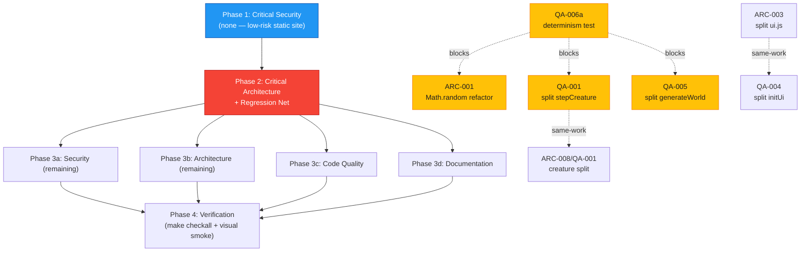

# Project Audit Report

> **Project**: small-world — procedural Three.js terrarium
> **Date**: 2026-06-16
> **Stack**: JavaScript (ES modules), Three.js r0.184, simplex-noise 4, Vite 8, GLSL shaders, GitHub Actions → GitHub Pages
> **Audited by**: Claude Code Audit System (4 parallel expert agents + synthesis)

---

## Executive Summary

`small-world` is in **good health for what it is** — a client-side-only procedural art piece. The codebase is clean of debt markers (zero TODO/FIXME/HACK), unusually well-documented (`CLAUDE.md` is exemplary), resource disposal is more careful than typical Three.js apps, the shaders are uniformly guarded against divide-by-zero, and the security surface is essentially nil (no backend, no auth, no secrets, `npm audit` clean, all DOM writes via `textContent`). The single biggest strength is the **documented institutional knowledge** of hard-won gotchas.

The most impactful findings are **maintainability and correctness-fragility**, not security or scale. Two issues dominate: (1) **determinism** — the project's central promise (a seed reproduces a world) rests on a monkey-patched global `Math.random` with no mechanical enforcement and **no test to catch drift**; and (2) **three God functions** (`stepCreature` ~860 LOC, `generateWorld` ~1410 LOC, `initUi` ~2363 LOC) that are the hardest code in the repo to change safely — and which are shielded by a test suite that is ~84% source-text string matching rather than behavioral assertions. There are also two genuine latent bugs (WebGL context-loss crashes with no recovery; a cancelled regen can leave `isGeneratingWorld = true` forever) and a legal-metadata slip (`package.json` says `ISC`, the repo ships `MIT`).

Estimated effort to remediate the top issues: **1–2 days** for the license fix, the two critical bug fixes, and a determinism regression test (the highest-leverage work); **1–2 sprints** for the structural refactors (splitting the three God functions), which should be sequenced *after* the regression net exists.

### Issue Count by Severity

| Severity | Architecture | Security | Code Quality | Documentation | Total |
|----------|:-----------:|:--------:|:------------:|:-------------:|:-----:|
| 🔴 Critical | 1 | 0 | 3 | 2 | **6** |
| 🟠 High     | 3 | 0 | 8 | 3 | **14** |
| 🟡 Medium   | 5 | 1 | 10 | 4 | **20** |
| 🔵 Low      | 7 | 4 | 11 | 4 | **26** |
| **Total**   | **16** | **5** | **32** | **13** | **66** |

> **Calibration note:** This is a static, client-side art piece with no backend, auth, or PII. Findings are scaled to that profile. "Critical" here means *critical to the project's core promise or to correctness*, not a security/data-breach emergency. The security audit found **no Critical or High** issues.

---

## 🔴 Critical Issues (Resolve Immediately)

### [ARC-001] Determinism rests on a monkey-patched global `Math.random` with no enforcement
- **Area**: Architecture
- **Location**: `src/world.js:304-322` (install/restore), `src/world.js:328` (biome roll anchoring determinism), `src/portal.js:225` (preview must replay the exact RNG sequence)
- **Description**: Determinism is achieved by reassigning `Math.random = mulberry32(seed)` for the duration of (now async) world-gen, restoring it around each `await` via `yieldIfNeeded`, then finally restoring the original. The contract is real but **implicit and unenforced** — no lint rule, no type check, and **no test** verifies that a seed reproduces a byte-identical world. Any future builder that calls `Math.random` outside the bracketed window silently shifts the RNG stream and changes flora/creature placement for *every* seed at once.
- **Impact**: A single misplaced `Math.random()` changes the seed→world map invisibly (no error, just a different world). This is the highest-leverage footgun in the codebase and is the root cause of the `world.js`/`portal.js` constant duplication (ARC-002). The portal preview already has to manually replay the RNG to stay in sync.
- **Nuance from cross-check**: The Documentation audit (DOC-002) confirms determinism **currently works** across async yields — the code is correct today. The risk is *maintenance fragility*, not an active bug.
- **Remedy**: The immediate, low-risk mitigation is **a determinism regression test** (build N seeds twice, assert identical `world.children` traversal) — see QA-006a in the Remediation Plan, which must precede any world-gen refactor. The full structural remedy — thread an explicit `rng` through builders instead of relying on the global, and/or wrap `Math.random` in a throw-on-misuse Proxy during the seeded window — is large and optional; defer until the test exists.

### [QA-001] `stepCreature` is an ~860-line God function spanning 8 behavioral modes
- **Area**: Code Quality
- **Location**: `src/fauna/creature.js:1080-1940`
- **Description**: One per-frame function handles sleeper, waking, night-sleep, burrower (8-state FSM), flier (4-state landing FSM), fish cruise, walker, and perched modes, with multiple early `return`s (lines 1189, 1257, 1336) that make it easy for a new state to bypass cleanup (e.g. slope-pose update or obstacle slide).
- **Impact**: The single highest-risk function in the codebase. Any new creature behavior is woven into a ~2000-line decision tree; bugs here are nearly impossible to bisect; reviewers cannot scope a diff. An early-return path that misses the slope/obstacle cleanup silently corrupts the entity.
- **Remedy**: Split into `stepSleeper` / `stepBurrower` / `stepFlier` / `stepWalker` / `stepFish` dispatched from a thin `stepCreature` switch on `c.kind` / `c.landState`. **Blocked by QA-006a** (needs a behavioral test first). Overlaps ARC-008 — do once.

### [QA-002] WebGL `webglcontextlost` / `webglcontextrestored` are not handled
- **Area**: Code Quality
- **Location**: `main.js:67` (renderer construction) and the animate loop `main.js:348-374`
- **Description**: Confirmed by grep — zero matches for `webglcontextlost` / `webglcontextrestored` / `forceContextRestore`. The canvas has no `preventDefault` on context loss.
- **Impact**: On a GPU crash, driver reset, Windows multi-context exhaustion, or mobile tab reclaim, Three.js throws on the next render, the `requestAnimationFrame` loop dies, and the user sees a black canvas with **no recovery and no message**. CLAUDE.md acknowledges this gap.
- **Remedy**: Add `canvas.addEventListener("webglcontextlost", e => { e.preventDefault(); paused = true; })` plus a restore handler calling `renderer.forceContextRestore()` and re-running `generateWorld(state.currentSeed)`. (Product decision: full recovery vs. graceful "reload" prompt — see blocking notes.)

### [QA-003] Cancelled-but-superseded regen leaves `isGeneratingWorld = true`
- **Area**: Code Quality
- **Location**: `src/world.js:294` (early return) and `src/world.js:1688-1691` (finally guard)
- **Description**: `generateWorld` increments `_generationRunId`, then after the first `await` checks `if (runId !== _generationRunId) return;` — returning **before** the `try/finally` at 1688. The `finally` only resets `isGeneratingWorld` when `runId === _generationRunId`.
- **Impact**: A superseded run (user spamming regen) leaves `state.isGeneratingWorld = true` indefinitely if the superseding run also throws or is cancelled. Any UI gating on that flag (loading overlay, catalog clicks) deadlocks.
- **Remedy**: Always set `isGeneratingWorld = false` in the `finally` regardless of `runId`, or clear it on the early-return path at line 294. Surgical, low-risk.

### [DOC-001] License mismatch: `package.json` says `ISC`, the repo ships `MIT`
- **Area**: Documentation
- **Location**: `package.json:23` (`"license": "ISC"`) vs `LICENSE` (MIT, Copyright 2026 Paul Robello)
- **Description**: npm/CI tooling reads `ISC` from the manifest while the actual license file is MIT (the author's stated global default). License scanners and GitHub's repo-metadata panel report the manifest value.
- **Impact**: Contributors, consumers, and automated license-audit tooling see conflicting terms (ISC vs MIT have different wording). A compliance review would flag this.
- **Remedy**: Change `package.json` `"license"` to `"MIT"`; add a one-line `## License` section to README. Trivial — lands first.

### [DOC-002] `CLAUDE.md` "Determinism trick" contradicts the current async `generateWorld`
- **Area**: Documentation
- **Location**: `CLAUDE.md` ("The determinism trick (important when touching world-gen)") vs `src/world.js:285, 301-310`
- **Description**: CLAUDE.md states world-gen runs "synchronously inside `generateWorld` before `Math.random` is restored" and warns "Async work, timers… will use the real `Math.random`." The actual function is `export async function generateWorld(...)` and **explicitly reinstalls the seeded PRNG after every async yield** (lines 301-310). The gotcha as written is now actively misleading.
- **Impact**: This is the highest-value doc in the repo and the one it flags as "important when touching world-gen." An agent extending world-gen will either avoid needed async yields, or add async work without using the reinstall wrapper — reintroducing nondeterminism.
- **Remedy**: Rewrite the section to describe the real mechanism (the seeded PRNG is saved/restored around async yields via `yieldIfNeeded`; any new `await` in the deterministic window must use that wrapper). The code is already correct — only the doc is wrong. Safe to fix immediately.

---

## 🟠 High Priority Issues

### [ARC-002] Duplicated world-construction constants between `world.js` and `portal.js`
- **Area**: Architecture
- **Location**: `src/world.js:72,509` vs `src/portal.js:30,227` (`TERRAIN_NOISE_SEED_XOR = 0x5eed5eed` in both); `src/world.js:569-579` (`FLORA_FOOTPRINT`) vs `src/portal.js:33-40` (`PREVIEW_FLORA_FOOTPRINT`, an exact copy)
- **Description**: The portal preview reconstructs a faithful slice of the destination world, so it re-derives terrain noise, the height function, and the flora footprint table by hand-copying them.
- **Impact**: Adding a new flora kind requires updating both tables or the portal preview silently diverges from the real destination (a subtle visual bug). CLAUDE.md already flags this as a known hazard — evidence the duplication has bitten.
- **Remedy**: Extract a single source of truth — `src/flora/constants.js` exporting `FLORA_FOOTPRINT` / `OBSTACLE_TOP`, and `terrainNoiseFromSeed(seed)` in `src/terrain.js` (or `seed.js`). Both consumers import from there. **Should land before any new flora/biome addition.**

### [ARC-003] `ui.js` is a 2,870-LOC God module (overlaps QA-004)
- **Area**: Architecture
- **Location**: `src/ui.js` (entire file; ~40 top-level functions)
- **Description**: Mixes ≥7 concerns: settings persistence, photo mode, first-person stroll, fly mode, creature selection/follow, tour/cinematic mode, and help/bookmarks/biome-filter/share panels. It also injects callbacks back into the state singleton (`state._reapplyWindSettings` / `_reapplyGrassSettings`), creating hidden bidirectional coupling with `world.js` and `main.js`'s seed-watcher.
- **Impact**: The largest file in the project (3× the next-largest non-generated file); any feature change forces navigating 2,870 lines. Callback injection makes `world.js`/`main.js` implicitly depend on `ui.js` having run first.
- **Remedy**: Split into `src/ui/` submodules (`settings.js`, `photoMode.js`, `strollMode.js`, `followMode.js`, `tour.js`, `panels.js`), with `src/ui.js` as the composition root. Replace `state._reapplyXxx` hooks with an explicit settings-applier module both `world.js` and `main.js` import directly. **Same refactor as QA-004 — coordinate, do once.**

### [ARC-004] Test suite is ~88% static source-grep assertions, not behavioral (overlaps QA-006)
- **Area**: Architecture
- **Location**: `tests/` — 67 `.mjs` + 6 `.py` files; ~59 are `*-static.test.mjs` that `readFileSync` source and `assert(source.includes("..."))`
- **Description**: Static tests assert that specific string literals exist in source. They pass without ever loading Three.js or constructing a world. They are change-detectors: renaming a constant breaks them even when behavior is unchanged, while a behaviorally-correct refactor that rephrases source passes nothing.
- **Impact**: False confidence. The most complex logic (determinism window, flora placement, bloom mip chain) has zero runtime coverage. A real regression in `stepCreature` or `generateWorld` would ship undetected.
- **Remedy**: Keep static tests only for genuine source-level invariants. Convert placement/density/FSM tests to headless runtime tests (the ~11 existing runtime tests prove this is feasible). **Add a determinism test first** (QA-006a) as the regression net for all world-gen refactors.

### [QA-004] `initUi` is a ~2,363-line God function (overlaps ARC-003)
- **Area**: Code Quality
- **Location**: `src/ui.js:507-2870`
- **Description**: Every panel's DOM wiring, every event listener, the catalog renderer, photo mode, locator, bookmarks, and stroll mode live inside one function with nested closures.
- **Remedy**: Split into per-panel registration modules, each exporting a setup function called from a thin `initUi`. Coordinate with ARC-003.

### [QA-005] `generateWorld` is a ~1,410-line async God orchestrator
- **Area**: Code Quality
- **Location**: `src/world.js:285-1695`
- **Description**: Spans ~1,410 lines in one async `try`-block. The global `Math.random` is swapped at line 307 and restored at ~25 hand-scattered `yieldIfNeeded()` checkpoints. Placement phases (atmosphere, flora, creatures, cover) are inline closures with no testable boundary.
- **Impact**: The determinism contract (the project's central guarantee) is fragile — code added between checkpoints that calls `Math.random` silently corrupts seed reproducibility, with no test to catch it.
- **Remedy**: Extract placement phases into named async helpers each taking `worldState` and bracketing their own `Math.random` swap via a `withSeededRandom(seed, fn)` helper (portal.js already has this pattern at line 124). **Blocked by QA-006a.**

### [QA-006] Test suite is ~84% static source-text matching; zero determinism coverage
- **Area**: Code Quality
- **Location**: `tests/` (53 of 67 `.mjs` files + all 6 `.py` files); ~1,271 `source.includes('…')` assertions
- **Description**: Tests read source via `readFileSync` and assert exact literal lines exist; only ~11 `.mjs` files do real runtime imports. Zero tests instantiate Three.js, call `generateWorld`, run the `animate()` loop, compile a shader, exercise `disposeGroup`, or **test the determinism contract** (build a world twice from one seed and compare).
- **Impact**: A stub file containing the right strings would pass. 49 `!source.includes(...)` negative assertions actively resist legitimate refactors.
- **Remedy**: Convert high-value static tests to runtime tests; add one determinism test (same seed → byte-identical `world.children` traversal). **QA-006a (the determinism test slice) is promoted to Phase 2 as the blocking regression net for ARC-001, QA-001, QA-005.**

### [QA-007] `postfx.js` has no teardown path; every RT/material leaks on re-init
- **Area**: Code Quality (latent — `initPostFX` currently called once at `main.js:146`)
- **Location**: `src/postfx.js:528, 535, 562, 582, 674` (allocations); no matching `dispose()` in the returned API at `:734`
- **Description**: `depthTexture`, `depthRT`, `bloomRT`, `bloomMips[]`, bloom materials/quad, the `EffectComposer`, and `InputPass._quad.geometry` are allocated in `initPostFX` and never disposed. The returned API has no `dispose()` method.
- **Impact**: Dormant today (one call per page load). Any future path that rebuilds the composer (LOWFX toggle, hot-reload, a second scene) leaks every prior RT and material.
- **Remedy**: Add a `dispose()` to the returned API that tears down all RTs/materials/composer; call it before any re-init.

### [QA-008] `_reapplyWindSettings` is driven by a 250 ms `setInterval` poll, not by regen completion
- **Area**: Code Quality
- **Location**: `src/ui.js:1960-1975` (vs `src/world.js:1337` where grass is re-applied synchronously)
- **Description**: A 250 ms interval diffs `state.currentSeed` and re-applies wind settings. Unlike grass, wind reapplication is polled.
- **Impact**: A 0–250 ms window after every regen where the new world renders with default wind values before the user's slider values reapply — perceived "wind flicker" on each regen.
- **Remedy**: Mirror the grass path — have `world.js` invoke `state._reapplyWindSettings()` at the end of `generateWorld` (next to line 1337).

### [QA-009] Portal preview leaks the original flora/creature on every placement
- **Area**: Code Quality
- **Location**: `src/portal.js:464, 508`
- **Description**: `clonePreviewObjectUnique(builder(targetBiome))` calls the builder (allocating pooled geometry/material), clones it, then discards the original without disposal.
- **Impact**: Per-placement GPU-resource leak, multiplied by flora count × portals per world. Compounds across regens. Silent.
- **Remedy**: Capture the original in a variable, clone it, then `disposeGroup` the original after cloning.

### [QA-010] Duplicated sleepiness + slope-pose logic inside `stepCreature` (subsumed by QA-001)
- **Area**: Code Quality
- **Location**: `src/fauna/creature.js:1090-1111` (sleepiness) and `:1181-1256` (slope pose), duplicated across branches
- **Remedy**: Extract `sleepinessTarget(c, nf)` and `plantOnSlope(c, heightFn)`. Naturally resolved by the QA-001 split.

### [QA-011] `caterpillar.js` re-declares a local `wrapAngle` instead of importing the shared one
- **Area**: Code Quality
- **Location**: `src/fauna/caterpillar.js:443-444` (duplicate) vs `src/fauna/shared.js:213-214` (canonical, already imported by `creature.js:150`)
- **Description**: `stepCaterpillar` declares its own `const wrapAngle = (a) => …`, re-allocating a closure every frame per caterpillar (50+ instances).
- **Remedy**: `import { wrapAngle } from "./shared.js";` and delete the local. Easy, isolated fix.

### [DOC-003] `CLAUDE.md` says `newRandomSeed` "rerolls up to 24 times"; code rerolls up to 96
- **Area**: Documentation
- **Location**: `CLAUDE.md` ("Seed → biome → layout coupling") vs `src/seed.js:57,66`
- **Description**: Code: primary loop `for (let i = 0; i < 64; i++)` + fallback `for (let i = 0; i < 32; i++)` = up to 96 attempts. Signature also changed: doc says `newRandomSeed(excludeBiomeId)`, real is `newRandomSeed(opts = {})` accepting `{excludeBiomeId, allowedBiomeIds}`.
- **Remedy**: Update count to "up to 64 attempts (plus a 32-attempt fallback)" and document the `{excludeBiomeId, allowedBiomeIds}` options.

### [DOC-004] No LICENSE section in README; no `CONTRIBUTING.md`
- **Area**: Documentation
- **Location**: `README.md` (no License/Contributing sections); `CONTRIBUTING.md` missing
- **Description**: CLAUDE.md holds conventions but is explicitly agent-facing; human contributors have no documented PR process, code-style expectation, or test-command summary.
- **Remedy**: Add `## Contributing` (or a `CONTRIBUTING.md`) covering `npm install` → `make dev`, `make checkall` before PR, Conventional Commits. Add `## License` naming MIT.

### [DOC-005] `pickPerchForFlier` description omits nest-preference and fish/bee exclusion
- **Area**: Documentation
- **Location**: `CLAUDE.md` ("Flier landing system" → "Mushroom perches") vs `src/fauna/creature.js:1046-1075`
- **Description**: CLAUDE.md describes a single "55% chance to pick the nearest perch within 6 units." The real function also early-outs for fish/bees, prefers `flyer_nest` perches globally while non-nest perches are local-only, and skips perches with a live-parent occupant.
- **Remedy**: Update the section to: early-out for fish/bees; 55% gate; `flyer_nest` perches preferred (global), other kinds within 6 units; occupied-live-parent perches skipped.

---

## 🟡 Medium Priority Issues

### Architecture
- **[ARC-005] `createWorldBuildContext` is half-applied DI** — `src/world.js:171-186,285`. The context parameterizes only the top-level orchestrator; every downstream builder reads the global `state` singleton directly, so a test passing a mock `context.state` still gets the real `state` inside builders. Either commit to DI (thread `worldState` through) or drop the context param and document singleton-coupling.
- **[ARC-006] `state` singleton is a 35-field mutable grab-bag** — `src/state.js:16-160`; imported by 22 of ~30 files. Many fields carry non-obvious lifecycle contracts documented only in comments (e.g. `_dynPool` reset actually happens in `main.js`, not `world.js`). Document field ownership in a table; consider grouping into sub-objects; move `_dynPool` reset into `world.js`'s clear block.
- **[ARC-007] `environment.js` (1,621 LOC) secondary God module** — mixes ephemeral particles, instanced ground-cover factories, and the water subsystem (`makeWaterPlane` + `stepWater` + reflection `onBeforeCompile` patch at `:1476-1599`). Extract water into `src/water.js`.
- **[ARC-008] `flora.js` (3,225 LOC) and `creature.js` (1,940 LOC) oversized** — `FLORA_BUILDERS` is ~30 builders in one file. Mirror the existing `fauna/` per-entity split: move each flora builder into `src/flora/<kind>.js`. (The `creature.js` side overlaps QA-001.)

### Security
- **[SEC-001] GitHub Actions use floating major-version tags, not SHA pins** — `.github/workflows/deploy.yml:23,26,42,47,52` (`actions/checkout@v6`, `setup-node@v6`, `upload-pages-artifact@v5`, `deploy-pages@v5`). CWE-1357 / supply-chain. A compromised action repo would execute attacker code in a job with `pages: write` + `id-token: write` that runs `npm ci` (arbitrary postinstall). Pin each to a full commit SHA with a version comment; optionally add `dependabot.yml` (actions ecosystem). The workflow is otherwise well-scoped (minimal permissions, concurrency, no `pull_request_target`, no untrusted-input interpolation).

### Code Quality
- **[QA-012] `fur.js:104` divides by `uStripeBandCount` which defaults to 0.0** — `src/fur.js:104,158`. Latent NaN if a future caller sets `patternType: 1` without `stripeBandCount`. Guard: `1.0 / max(uStripeBandCount, 0.0001)`; also guard `uShellLayer / uLayers` (line 24) with `max(uLayers, 1.0)`.
- **[QA-013] `grass.js:429` `tmp.r / baseCol.r || 1` yields Infinity, not the fallback** — a biome with a zero red channel uploads garbage instance colors. Use `baseCol.r > 0 ? tmp.r / baseCol.r : 1` (repeat for g/b).
- **[QA-014] Water reflection `uInvViewport` initialized once, never updated on resize** — `src/environment.js:1499-1508`. Reflection UVs drift after window resize. Update in a resize handler or read drawing-buffer size per frame.
- **[QA-015] Catalog-load failures downgrade to `console.warn` and leave UI out of sync** — `src/ui.js:574,656` (warn) vs `:1820,1913,2610` (error); five `generateWorld` failure sites with inconsistent severity. Catalog sites silently proceed, so `state.currentBiome` mismatches the clicked entry. Route all five through one `reportGenFailure(error)` helper at `error` severity with a UI signal.
- **[QA-016] Music autoplay swallow at `music.js:172,196` can hide real network errors** — `.catch(() => {})` on a *user-gesture* play path masks 404/CORS; also no `"error"` listener on the `<audio>` element (154,160), so a missing biome track fails silently. Add `.catch((e) => console.warn(...))` on gesture paths and an `"error"` event listener.
- **[QA-017] `inspect.js` accepts unbounded hex seed input** — `src/inspect.js:529-533`. `parseInt(raw, 16)` on a long `0x…` param is silently `>>> 0`-truncated; the URL won't round-trip. Clamp to ≤ 8 hex digits like `seed.js:parseSeed`.
- **[QA-018] `WATER_SURFACE_Y = -0.12` duplicated across modules** — `src/world.js:879`, `src/fauna/creature.js:172`, `src/environment.js`. Drift between any two silently breaks fish depth or water-flora placement. Hoist to `state.js` (alongside `WATER_AVOID_Y`).
- **[QA-019] `avoidObstacles` has a 12-arg positional signature** — `src/fauna/shared.js:238-240`; callers thread four literal `undefined`s. Convert to an options object.
- **[QA-020 / SEC-006] `window.__sw` devtools handle ships to production** — `main.js:136`. Exposes live `state`/`renderer`/`controls`/`scene`/`camera` to any script on the page; mild XSS surface if a third-party script is ever injected. Gate: `if (import.meta.env?.DEV) window.__sw = …;`.
- **[QA-021] Burrower mounds need bespoke disposal** — `src/world.js:362-370`. Bypass the creature group and are hand-disposed before `disposeGroup`; CLAUDE.md warns about this pattern. Parent under the creature's group with a `userData.persistentAcrossDispose` flag so `disposeGroup` handles them.

### Documentation
- **[DOC-006] `CLAUDE.md` "Biome-flag pattern" omits the `angler`/`isAngler` derivation** — `CLAUDE.md` vs `src/fauna/creature.js:296` (`isFish = biome.creatureKind === "fish" || isAngler`). Add a note that the anglerfish variant also takes the fish path.
- **[DOC-007] `furProbability` "defaults to 0" understates that 8 of 12 biomes set it explicitly** — `CLAUDE.md` vs `src/biomes.js` (lines 23,110,148,229,269,309,395,430). README's "Fuzzy biomes" list (mossy/cloud/frozen/grove) is now stale. Update README to reflect the current fur-biome set; ship the doc fix with any biome-table retuning.
- **[DOC-008] `generateWorld` has no docstring at its definition** — `src/world.js:285`. The most important entry point in the codebase is bare; a contributor opening it cold must read CLAUDE.md + 100 lines. Add a JSDoc block (params, async/yield determinism contract, HUD/URL side effects); also `createWorldBuildContext` (line 171).
- **[DOC-009] `MAX_DENSITY_MULTIPLIER` (75) and `opts.maxDensityMultiplier` override undocumented** — `CLAUDE.md` "Live grass density" vs `src/grass.js:26,323`. Add "`MAX_DENSITY_MULTIPLIER = 75` caps over-allocation."

---

## 🔵 Low Priority / Improvements

### Architecture
- **[ARC-009]** `AGENTS.md` and `GEMINI.md` are one-line `read @CLAUDE.md` stubs — three files to keep in sync. Consider a single canonical file.
- **[ARC-010]** `vite.config.js` `server.port` is **1999**; Makefile/`package.json` scripts/CLAUDE.md all say **2001**. `make dev` (2001) and `npm run dev` (1999) serve different ports. Align the vite default to 2001.
- **[ARC-011]** `preserveDrawingBuffer: true` (`main.js:73`) is always-on for photo capture; has a small perf cost. Flip on only when entering photo mode.
- **[ARC-012]** Stray `.server.log` / `.vite-dev.log` in repo root — confirm `.gitignore` coverage.
- **[ARC-013]** `MIDFX`/`LOWFX` defaults mutate `state.userSettings` at import time (`state.js:127-129`), coupling device-detection to settings defaults; a `getDefaultUserSettings(deviceTier)` would be cleaner.

### Security (informational / hardening)
- **[SEC-002] No CSP** — `index.html`. GitHub Pages can't set headers; a `<meta http-equiv="Content-Security-Policy">` tag is the only option. Modest value (no `eval`/`innerHTML`-with-user-data/CDN scripts already), but good defense-in-depth. Suggested policy: `default-src 'self'; img-src 'self' data: blob:; media-src 'self' https://static.pardev.net; style-src 'self' 'unsafe-inline' https://fonts.googleapis.com; font-src 'self' https://fonts.gstatic.com; connect-src 'self';`.
- **[SEC-003] No `permissions-policy`/`referrer-policy`/`X-Content-Type-Options` headers** — not configurable on stock GitHub Pages; only actionable if moved behind your own origin (pardev.net infra).
- **[SEC-004] Google Fonts loaded from third-party origin** — `index.html:16-19`. Leaks visitor IP + referrer to Google on every load (the only off-origin request besides music). Optional: self-host the three families under `public/fonts/`.
- **[SEC-005] localStorage confirmed-safe (informational)** — `src/ui.js` + `src/catalog.js`. All stored values are non-sensitive user preferences, seed bookmarks, and local-only IndexedDB photo blobs. No credentials/PII; catalog has no remote upload path. Recorded as a confirmed-clean check, not a defect.

### Code Quality
- **[QA-022]** Unused uniforms in `sky.js` edge-mist shader — `uColC` (`:761,787`) and `uStreakScale` (`:764,790`) declared/bound but never sampled. Remove or wire up.
- **[QA-023]** `_copyShader` fragmentShader (`postfx.js:460`) is the only FS in the file missing `precision highp float;`. Inconsistent with siblings.
- **[QA-024]** Precision-qualifier inconsistency codebase-wide — some FS declare `precision highp float;`, others (sky dome, starfield, aurora, portal view, all VS) rely on three's prefix. Pick one convention.
- **[QA-025]** `ui.js:1840` documented dead assignment — `let ok = false; // eslint-disable-line no-useless-assignment`. Remove the disable and the initializer.
- **[QA-026]** `requestPointerLock?.().catch(() => {})` copy-pasted 6× (`ui.js:823,827,915,1016,2279,2340`). Extract `safeRequestPointerLock()`.
- **[QA-027]** `== null` loose equality at `inspect.js:530,535,827,836`, `world.js:711`, `ui.js:1938` — inconsistent with `===` elsewhere; low risk.
- **[QA-028]** `world.js:558-560` comment says biome counts tuned against a "38-unit base" but `state.js` documents `DENSITY_BASE = 76`. One is wrong; reconcile.
- **[QA-029]** Variable shadow in `creature.js:1751,1758` — inner `const n` shadows outer `const n = c.moundEmergeNormal`. Rename.
- **[QA-030]** `portal.js:308` `state.userSettings = previous.userSettings` is a no-op (reads saved, assigns same ref). Misleading dead code.
- **[QA-031]** Per-frame CPU water-vertex rewrite (`environment.js:1600-1618`) — ~2,300 verts/frame of JS work the water material's `onBeforeCompile` could do in the vertex shader. Low impact.
- **[QA-032]** `grass.js:323-324` over-allocates `instanceMatrix` to `MAX_DENSITY_MULTIPLIER × stock` (~75×) but only writes `maxPlaced` rows — VRAM waste on dense biomes (uninitialized rows are never drawn).

### Documentation
- **[DOC-010]** README "Features" bullets list modes without inline keys (`F` stroll, `V` fly); keys only appear in the Controls table. Inline for scannability.
- **[DOC-011]** `docs/DOCUMENTATION_STYLE_GUIDE.md` exists but nothing references it. Link it from README/CONTRIBUTING.
- **[DOC-012]** No `## Troubleshooting` anywhere (port 2001 in use, missing `node_modules`, music on separate host, `?lowfx=1`). Add a short section to README.
- **[DOC-013]** `ideas.md` still lists "Ambient bed per biome" (Audio, S) though per-biome music is shipped — violates the file's own removal convention. Prune.
- **[DOC-014]** CLAUDE.md "Browser debugging" references Codex-specific terminology ("Codex Desktop", "Codex browser tooling"); generalize or mark Codex-specific for Claude contributors.

---

## Detailed Findings

### Architecture & Design
The architecture is **good overall**, organized as a flat ES-module graph with `main.js` as the entry/animate-loop and concern modules under `src/`. Strengths: a clean `makeX`/`stepX` contract (factory returning `{group, …state}` + pure step function iterated by `animate()`'s flat phase list — no inheritance or hidden registration); the biome-flag pattern (`water`, `cloudlike`, `glowFlowers`, `glowEyes`, `furProbability`, `creatureKind`) is the right OCP trade-off for a 12-biome system; a sophisticated, correctly-reasoned post-FX pipeline (hand-rolled Jimenez mip-chain bloom with Karis averaging, depth pre-pass RT kept *outside* the composer's ping-pong to avoid the WebGL feedback loop, gamma-space tilt-shift); centralized, careful resource disposal via `disposeGroup` with shared-material dedup; and intentional performance architecture (`InstancedMesh`, per-frame scratch-vector reuse, pooled `_dynPool`, density scaling anchored to `DENSITY_BASE`).

**Key concern:** determinism rests on a global `Math.random` monkey-patch with no mechanical enforcement (ARC-001), and it is the root cause of the `world.js`/`portal.js` constant duplication (ARC-002). `ui.js` (ARC-003), `environment.js` (ARC-007), `flora.js`, and `creature.js` (ARC-008) are oversized. The `state` singleton (ARC-006) is the de-facto integration bus with field-ownership documented only in comments. The test suite (ARC-004) gives false confidence.

### Security Assessment
**Strong posture for a static client-side site.** No Critical or High issues. **Zero dependency vulnerabilities** (`npm audit` clean; three/simplex-noise/vite/eslint all current majors). **No secrets anywhere** (swept source, workflows, config; `.gitignore` covers `.env*`, `*.pem`, `*.key`, `public/music/`). **No `eval`/`new Function()`/`document.write`/string-arg `setTimeout`.** **All HUD/world-data DOM writes use `textContent`**, not `innerHTML`, closing the entire DOM-XSS class from biome names, island names, seed display, and creature counts. URL params are parsed safely (`parseSeed` regex-validates and `>>> 0`-coerces; biome id validated against the `BIOMES` table). The only `innerHTML` assignments interpolate internal config-table strings, hardcoded music filenames, or same-origin `blob:`/`data:` URLs — all safe. The only network egress is the music stream to the user's own `static.pardev.net`. The GitHub Actions workflow is well-scoped (minimal permissions, concurrency, no `pull_request_target`, no untrusted-input interpolation). The photo catalog is local-only (IndexedDB, no remote upload). **The single Medium finding (SEC-001) is floating action tags instead of SHA pins**; the rest is informational hardening (CSP, security headers, self-hosted fonts).

### Code Quality
**Fair.** The code is clean of debt markers (zero TODO/FIXME/HACK/XXX), well-commented, and the shaders/disposal are better than typical Three.js projects. GLSL divide-by-zero guards are uniformly correct where they matter (`invXZScaleSq`, pusher `pdl`, particle point-size, portal `radialDir`, grass-aura `normalize` all use `max(..., eps)`). WebGL1 GLSL style is fully consistent. `shared.js` is genuinely shared. `disposeGroup` covers the regen path well. **However**, three God functions (`stepCreature` ~860 LOC, `generateWorld` ~1410 LOC, `initUi` ~2363 LOC) and an ~84% static test suite are real maintainability anchors. Two genuine latent bugs exist (WebGL context-loss crash with no recovery, QA-002; cancelled-regen `isGeneratingWorld` leak, QA-003). The off-group resource leaks (postfx RTs QA-007, portal preview originals QA-009) are dormant today but will bite on any future composer-rebuild or portal-persistence path. **14 files exceed 500 LOC** — a long-tail-of-large-files problem concentrated in `flora.js` and `ui.js`.

### Documentation Review
**Good** — high-quality prose docs with a few high-impact accuracy drifts in the single most important file. `CLAUDE.md` is unusually thorough (the determinism, biome-flag, grass-pusher, flier-FSM, and follow-anchor gotchas are exactly the load-bearing traps contributors need). CHANGELOG discipline is best-in-class (Added/Changed/Fixed/Verified, newest first, every entry ends with a `### Verified` block citing exact commands). Version injection is fully wired and verified (`package.json` → `vite.config.js define` → `state.js APP_VERSION` → `index.html`). README screenshots are deep links to reproducible worlds. `graphify-out/GRAPH_REPORT.md` is current. **But:** the determinism-trick section now actively misleads (DOC-002); the license manifest is wrong (DOC-001); `newRandomSeed` count/signature and the perch-selection logic have drifted (DOC-003, DOC-005); the `angler`/fish derivation and fur-prevalence are understated (DOC-006, DOC-007); and `generateWorld` lacks a JSDoc (DOC-008). No human-facing CONTRIBUTING guide exists.

---

## Remediation Roadmap

### Immediate Actions (Before Next Deployment)
1. **DOC-001** — Fix `package.json` license `ISC` → `MIT`; add README `## License`. (trivial)
2. **QA-003** — Fix cancelled-regen `isGeneratingWorld` leak in `world.js` `finally`. (surgical)
3. **QA-002** — Add WebGL context-loss/restore handling in `main.js`. (additive)
4. **DOC-002** — Rewrite CLAUDE.md "determinism trick" to describe the async save/reinstall wrapper. (code already correct)

### Short-term (Next 1–2 Sprints)
1. **QA-006a** — Add a determinism regression test (same seed → identical world). *This is the regression net that unblocks every structural refactor below.*
2. **QA-008** — Reapply wind settings synchronously on regen (kills the wind-flicker).
3. **QA-009** — Dispose portal preview originals after cloning.
4. **QA-011** — Import shared `wrapAngle` in `caterpillar.js`.
5. **QA-012/013/014/017/018** — Surgical guards (fur div-by-zero, grass Infinity, water-reflection resize, inspect seed clamp, hoist `WATER_SURFACE_Y`).
6. **SEC-001** — SHA-pin the GitHub Actions.
7. **DOC-003/004/005** — CLAUDE.md accuracy fixes + README License/Contributing.
8. **ARC-002** — Dedup `world.js`/`portal.js` constants (before any new flora/biome).

### Long-term (Backlog)
1. **ARC-003 / QA-004** — Split `ui.js` into `src/ui/` submodules.
2. **ARC-008 / QA-001** — Split `flora.js` per-builder and `stepCreature` per-mode (after QA-006a).
3. **QA-005** — Extract `generateWorld` placement phases (after QA-006a).
4. **ARC-007** — Extract water subsystem to `src/water.js`.
5. **QA-006 (full)** — Convert static tests to runtime tests broadly.
6. **ARC-001 (full)** — Thread explicit `rng` through builders (optional hardening; defer until the determinism test is green and stable).
7. **ARC-005/006** — Resolve the `state` singleton ownership/DI ambiguity.

---

## Positive Highlights

1. **Exceptional domain documentation.** `CLAUDE.md`'s gotchas (caterpillar segments vs group, grass bend inverse-rotation, depth-RT-outside-composer, flier FSM, yaw-slew-not-snap) encode hard-won institutional knowledge that prevents real bugs. A model for agent-facing architecture docs.
2. **Best-in-class CHANGELOG discipline** — Added/Changed/Fixed/Verified sections, newest first, every entry ending with a `### Verified` block citing the exact commands run. Rare and valuable.
3. **The `makeX`/`stepX` contract is clean and consistent** across fauna, environment, grass, shadows, and clouds — a flat, readable phase list in `animate()` with no inheritance or hidden update registration.
4. **Sophisticated, correctly-reasoned post-FX pipeline** — the hand-rolled Jimenez mip-chain bloom with Karis averaging, the depth pre-pass RT outside the composer's ping-pong (avoiding the WebGL feedback loop), and gamma-space tilt-shift are non-obvious, correct decisions with comments justifying the failure modes they prevent.
5. **Centralized, careful resource disposal** — `disposeGroup` dedupes shared materials across meshes; per-regen `resetFloraPool`/`resetCreaturePool`/`resetPBRTextureCache` are sequenced correctly.
6. **Strong security posture for a static site** — `npm audit` clean, no secrets, all DOM writes via `textContent`, URL params validated, well-scoped GitHub Actions. Zero Critical/High security findings.
7. **Zero TODO/FIXME/HACK/XXX markers** — the codebase genuinely doesn't accumulate "fix-this-later" cruft.
8. **GLSL divide-by-zero guards are uniformly correct** where they matter, and WebGL1 GLSL style is fully consistent.

---

## Audit Confidence

| Area | Files Reviewed | Confidence |
|------|---------------|-----------|
| Architecture | ~18 core modules + build/CI config | High |
| Security | all `src/`, workflows, manifests, `index.html` + `npm audit` + git log | High |
| Code Quality | all 14 files >500 LOC + full `tests/` + grep sweeps | High |
| Documentation | README, CLAUDE.md, CHANGELOG, ideas.md, docs/, graphify-out + code cross-checks | High |

*All four agents cross-verified specific numeric/signature claims against the code. The CLAUDE.md accuracy checks (DOC-002/003/005) were spot-checked line-by-line. Low-confidence areas: none flagged.*

---

## Remediation Plan

> This section is generated by the audit and consumed directly by `/fix-audit`.
> It pre-computes phase assignments and file conflicts so the fix orchestrator
> can proceed without re-analyzing the codebase.

### Phase Assignments

#### Phase 1 — Critical Security (Sequential, Blocking)
<!-- No critical or high security issues exist. This is a low-risk static client-side site. -->

*No Phase 1 items. Skip directly to Phase 2.*

#### Phase 2 — Critical Architecture + Regression Net (Sequential, Blocking)
<!-- The determinism contract is the project's core promise. Land the regression net
     BEFORE any world-gen / creature / UI refactor. -->

| ID | Title | File(s) | Severity | Blocks |
|----|-------|---------|----------|--------|
| DOC-001 | Fix license `ISC`→`MIT` | `package.json`, `README.md` | Critical | (none — trivial, lands first) |
| DOC-002 | Rewrite CLAUDE.md determinism-trick for async `generateWorld` | `CLAUDE.md` | Critical | (code already correct — safe immediately) |
| QA-003 | Fix cancelled-regen `isGeneratingWorld` leak | `src/world.js:294,1688-1691` | Critical | (none — surgical) |
| QA-002 | Add WebGL context-loss/restore handling | `main.js:67,348-374` | Critical | (none — additive; needs product decision on full-recovery vs reload-prompt) |
| **QA-006a** | **Add determinism regression test (same seed → identical `world.children`)** | `tests/` (new) | High (promoted) | **ARC-001, QA-001, QA-005** |
| ARC-001 | Determinism monkey-patch fragility (full rng-threading remedy) | `src/world.js`, `src/portal.js`, all builders | Critical | (optional; defer full remedy until QA-006a is green) |

> **QA-006a is the linchpin.** The Architecture and Code-Quality agents independently agree: every structural refactor of world-gen, creature stepping, or UI wiring must land *after* a behavioral determinism test exists. Land it first.

#### Phase 3 — Parallel Execution
<!-- All remaining work, safe to run concurrently by domain. -->

**3a — Security (remaining)**
| ID | Title | File(s) | Severity |
|----|-------|---------|----------|
| SEC-001 | SHA-pin GitHub Actions | `.github/workflows/deploy.yml` | Medium |
| SEC-002 | Add CSP `<meta>` tag | `index.html` | Low |
| SEC-003 | Security headers (hosting move) | hosting (not code) | Low |
| SEC-004 | Self-host Google Fonts | `index.html`, `public/fonts/` | Low |
| SEC-006 / QA-020 | Gate `window.__sw` behind `import.meta.env.DEV` | `main.js:136` | Low |

**3b — Architecture (remaining)**
| ID | Title | File(s) | Severity | Note |
|----|-------|---------|----------|------|
| ARC-002 | Dedup world/portal constants | new `src/flora/constants.js`, `src/terrain.js`, `src/world.js`, `src/portal.js` | High | land before any new flora/biome |
| ARC-003 | Split `ui.js` into `src/ui/` submodules | `src/ui.js` (+ importers) | High | **same work as QA-004 — do once** |
| ARC-005 | Resolve `createWorldBuildContext` DI half-measure | `src/world.js:171-186,285` | Medium | |
| ARC-006 | Document/group `state` singleton fields | `src/state.js` | Medium | |
| ARC-007 | Extract water subsystem to `src/water.js` | `src/environment.js`, new `src/water.js` | Medium | |
| ARC-008 | Split `flora.js` per-builder (+ `creature.js` split) | `src/flora.js`, `src/fauna/creature.js` | Medium | **creature side = QA-001 — do once** |

**3c — Code Quality (all)**
| ID | Title | File(s) | Severity |
|----|-------|---------|----------|
| QA-001 | Split `stepCreature` per-mode (= ARC-008 creature side) | `src/fauna/creature.js` | Critical |
| QA-004 | Split `initUi` (= ARC-003) | `src/ui.js` | High |
| QA-005 | Extract `generateWorld` placement phases | `src/world.js` | High |
| QA-006 | Convert static tests → runtime tests (broad) | `tests/` | High |
| QA-007 | Add `dispose()` to postfx API | `src/postfx.js` | High |
| QA-008 | Reapply wind settings on regen | `src/ui.js`, `src/world.js:1337` | High |
| QA-009 | Dispose portal preview originals | `src/portal.js:464,508` | High |
| QA-010 | Dedup sleepiness/slope-pose (subsumed by QA-001) | `src/fauna/creature.js` | High |
| QA-011 | Import shared `wrapAngle` | `src/fauna/caterpillar.js:443` | High |
| QA-012 | Guard `fur.js` `uStripeBandCount` div-by-zero | `src/fur.js:104,158` | Medium |
| QA-013 | Guard `grass.js` zero-base-color Infinity | `src/grass.js:429` | Medium |
| QA-014 | Update water-reflection `uInvViewport` on resize | `src/environment.js:1499` | Medium |
| QA-015 | Unify catalog/regen failure handling | `src/ui.js` (5 sites) | Medium |
| QA-016 | Music gesture-path + `<audio>` error logging | `src/music.js:154,160,172,196` | Medium |
| QA-017 | Clamp inspect hex seed to ≤8 digits | `src/inspect.js:529` | Medium |
| QA-018 | Hoist `WATER_SURFACE_Y` to `state.js` | `src/world.js`, `src/fauna/creature.js`, `src/environment.js` | Medium |
| QA-019 | `avoidObstacles` → options-object signature | `src/fauna/shared.js:238` | Medium |
| QA-021 | Parent burrower mounds for auto-disposal | `src/world.js:362-370` | Medium |
| QA-022–032 | Low-severity cleanups (unused uniforms, precision, dead assigns, shadowing, etc.) | various | Low |

**3d — Documentation (all)**
| ID | Title | File(s) | Severity |
|----|-------|---------|----------|
| DOC-003 | Fix `newRandomSeed` count/signature in CLAUDE.md | `CLAUDE.md` | High |
| DOC-004 | Add README `## Contributing` + `## License` / `CONTRIBUTING.md` | `README.md`, `CONTRIBUTING.md` | High |
| DOC-005 | Update `pickPerchForFlier` perch-selection logic | `CLAUDE.md` | High |
| DOC-006 | Document `angler`/`isAngler` fish derivation | `CLAUDE.md` | Medium |
| DOC-007 | Correct fur-biome prevalence (CLAUDE.md + README) | `CLAUDE.md`, `README.md` | Medium |
| DOC-008 | Add JSDoc to `generateWorld` + `createWorldBuildContext` | `src/world.js` | Medium |
| DOC-009 | Document `MAX_DENSITY_MULTIPLIER` | `CLAUDE.md` | Medium |
| DOC-010–014 | Low-severity doc cleanups (key bindings, style-guide link, troubleshooting, ideas.md prune, Codex wording) | various | Low |

### File Conflict Map
<!-- Files touched by issues in multiple domains. Fix agents MUST read current file
     state before editing — a prior agent may have already changed these. -->

| File | Domains | Issues | Risk |
|------|---------|--------|------|
| `src/world.js` | Architecture + Code Quality + Documentation | ARC-001, ARC-002, ARC-005, QA-003, QA-005, QA-008, QA-018, QA-021, DOC-008 | ⚠️ **Highest — 9 issues across 3 domains. Read before every edit.** |
| `src/ui.js` | Architecture + Code Quality | ARC-003, ARC-006, QA-004, QA-008, QA-015, QA-025, QA-026 | ⚠️ High — coordinate the split (ARC-003/QA-004) before surgical fixes |
| `src/fauna/creature.js` | Architecture + Code Quality | ARC-008, QA-001, QA-010, QA-029 | ⚠️ High — the split (ARC-008/QA-001) subsumes QA-010 |
| `package.json` | Architecture + Documentation | ARC (license low), DOC-001 | Low — both are the license fix; do together |
| `tests/` | Architecture + Code Quality | ARC-004, QA-006, QA-006a | Low — same concern (test-suite quality) |
| `main.js` | Code Quality (+ Security) | QA-002, QA-020/SEC-006, ARC-011 | Low — independent edits |
| `src/portal.js` | Architecture + Code Quality | ARC-002, QA-009, QA-030 | Low |
| `src/environment.js` | Architecture + Code Quality | ARC-007, QA-014, QA-031 | Low |
| `src/state.js` | Architecture + Code Quality | ARC-006, (QA-018 target) | Low |
| `CLAUDE.md` | Documentation only | DOC-002, DOC-003, DOC-005, DOC-006, DOC-007, DOC-009 | None — single domain, sequential edits fine |
| `index.html` | Security only | SEC-002, SEC-004 | None — single domain |

### Blocking Relationships
<!-- Explicit dependency declarations from audit agents.
     Format: [blocker issue] → [blocked issue] — reason -->

- **QA-006a → ARC-001, QA-001, QA-005** — the determinism test is the regression net; structural refactors of world-gen / creature-stepping must land after it exists. *(Both the Architecture and Code-Quality agents independently flagged this.)*
- **ARC-002 → (future flora/biome additions)** — dedup the shared constants before adding any new flora kind, or the portal preview diverges from the real destination world.
- **ARC-003 ↔ QA-004** — both describe the same `ui.js` split; implement once, not twice.
- **ARC-008 (creature side) ↔ QA-001** — both describe the same `creature.js`/`stepCreature` split; implement once. QA-010 (dedup sleepiness/slope) is naturally resolved by it.
- **QA-001 / QA-005 → require QA-006a first** — splitting `stepCreature` and `generateWorld` without a behavioral test risks silent drift.
- **QA-002 → product decision** — full recovery (re-run `generateWorld`) vs. graceful reload-prompt is a UX call, not a code call; resolve before implementing.
- **DOC-007 → coordinate with any biome-table fur retuning** — ship the README/CLAUDE.md fur-biome correction alongside biome-table changes to avoid a second round of drift.
- **DOC-001 → lands first** — trivial, unblocks all downstream license-metadata tooling.

### Dependency Diagram

